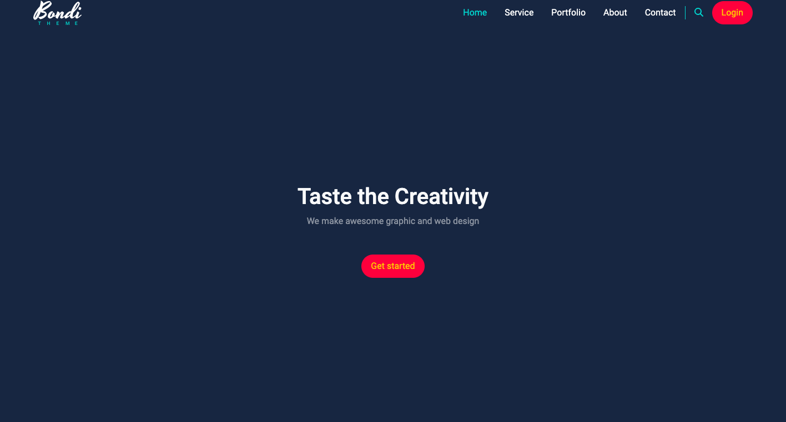

# Bondi - Project

## Table of contents

- [Overview](#overview)
  - [Project goal](#project-goal)
  - [Screenshot](#screenshot)
  - [Links](#links)
- [My process](#my-process)
  - [Built with](#built-with)

## Overview

### Project goal

Users should be able to:

- View the optimal layout for the site depending on their device's screen size
- Move smoothly between the sections

### Screenshot

### Links

- Live Site URL: [Bondi-Design](https://ahmedtakeshy.github.io/Bondi-Design/)

## My process

### Built with

- Semantic HTML5 markup
- CSS custom properties
- Flexbox
- CSS Grid
- Mobile-first workflow
- [Bootstrap](https://getbootstrap.com/) - Frontend toolkit
